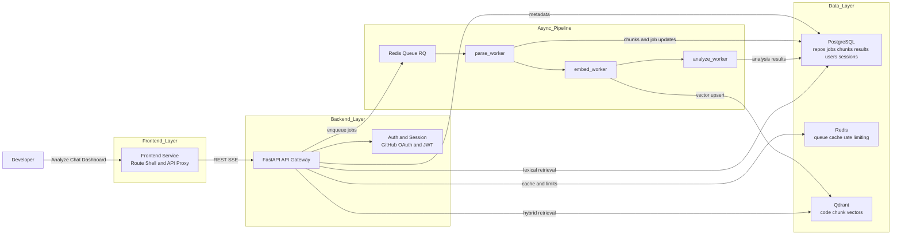

# DevLens

DevLens is an AI-powered GitHub repository analyzer. It ingests a public repository, builds searchable code intelligence, and serves:

- analysis dashboards (architecture, quality, tech debt, contributor context)
- cited repository chat (RAG over indexed code)
- export and share workflows

## What DevLens Does

1. Accepts a public GitHub URL.
2. Runs an async pipeline: `parse -> embed -> analyze`.
3. Streams progress to the client via SSE.
4. Stores metadata/results in PostgreSQL and vectors in Qdrant.
5. Exposes dashboard/chat APIs and a web UI for exploration.

## Core Features

- Repository analysis with idempotent submission and cache hits by repo+commit.
- Live progress tracking (`queued`, `parsing`, `embedding`, `analyzing`, `done/failed`).
- Dashboard panels for:
  - quality score
  - architecture summary
  - contributor stats
  - tech-debt flags
  - file tree metadata
- RAG chat with streaming responses and source citations.
- Export options (Markdown/HTML/PDF) and signed share links (TTL + revoke).
- GitHub OAuth login with backend-issued JWT sessions.
- Guest-mode rate limiting and authenticated limits.

## Architecture

## Tech Stack

### Backend and Workers
- FastAPI
- SQLAlchemy + Alembic
- PostgreSQL
- Redis + RQ
- Qdrant
- PyJWT + GitHub OAuth
- httpx / pytest
- Docker / Docker Compose

### AI and Retrieval
- Hybrid retrieval:
  - dense search in Qdrant
  - lexical search in PostgreSQL FTS (`tsvector` + `ts_rank_cd`)
- LLM synthesis via OpenRouter (model configurable by env)

## Repository Structure

- `backend/` API service
- `workers/` async processing pipeline
- `frontend/` web UI server and route views
- `docs/` product, API, test, release, and observability docs
- `scripts/` local automation scripts
- `docker-compose.yml` local multi-service runtime

## Local Development

### Prerequisites
- Docker + Docker Compose
- PowerShell (scripts are `.ps1`)
- Node.js (for frontend local test/runtime)

### Start and Stop
1. Start local stack: `./scripts/dev-up.ps1`
2. Verify: `docker compose ps`
3. Stop stack: `./scripts/dev-down.ps1`

### Database
- Apply migrations: `./scripts/db-migrate.ps1`

### Tests
- Backend tests: `./scripts/test-backend.ps1`
- Worker tests: `./scripts/test-worker.ps1`
- Frontend tests: `npm --prefix frontend test`

## Environment Configuration

Use these templates:
- `backend/.env.example`
- `workers/.env.example`
- `frontend/.env.example`

Configuration is fail-fast for missing required variables.

## Security Notes

- Auth authority is backend JWT session management.
- Refresh/logout endpoints enforce trusted origin/referer checks.
- CSRF protection uses double-submit cookie:
  - cookie: `devlens_csrf_token`
  - header: `X-CSRF-Token`
- Analyze endpoint is rate limited (guest/auth buckets).

## Key Endpoints

### Health
- Backend: `http://localhost:8000/health`
- Frontend: `http://localhost:3000/health`
- Qdrant: `http://localhost:6333/healthz`

### API (base `/api/v1`)
- `POST /repos/analyze`
- `GET /repos/{repo_id}/status` (SSE; supports `once=true`)
- `GET /repos/{repo_id}/dashboard`
- `POST /chat/sessions`
- `POST /chat/sessions/{id}/message` (SSE streaming)
- `GET /auth/github`, `GET /auth/callback`, `POST /auth/refresh`
- `POST /export/{repo_id}/share`, `DELETE /export/share/{share_id}`

## Deployment

Current production deployment:
- Railway: backend, worker, frontend, postgres, redis, qdrant

## Project Documentation

- API Contract: `docs/api/API_Contract_v1.1.md`
- Implementation checklist: `docs/planning/Implementation_Checklist.md`
- CI/CD runbook: `docs/release/CI_CD_Runbook.md`
- Deployment checklist: `docs/release/Phase5_Deployment_Checklist.md`
- QA report: `docs/testing/Release_QA_v1.1.md`
- Load/SLA validation: `docs/testing/DEV-072_Load_SLA_Validation.md`
- Observability notes: `docs/observability/README.md`
