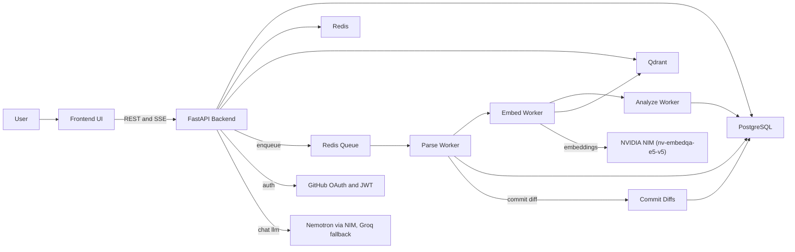

# DevLens

DevLens is a full-stack repository intelligence platform that analyzes public GitHub repositories and gives you:
- architecture and quality insights
- searchable repository context
- citation-grounded chat over indexed code

It is built as a production-oriented pipeline (API + workers + vector store + UI), and can run both locally with Docker and on a single cloud VM (AWS).

## Live Demo

[](https://44-206-66-89.sslip.io)

> **Private alpha.** The demo runs on a small AWS instance to conserve limited free-tier
> credits, so access is invite-only. Opening the link shows a login page asking for an
> access key, **contact the author** ([GitHub](https://github.com/atikulmunna)) to request
> one. Chat additionally requires signing in with GitHub inside the app.

## Demo Screenshot


## Why DevLens

When you open a new repository, understanding it quickly is hard. DevLens automates that first-pass intelligence:
1. ingest repo
2. parse and chunk code
3. embed chunks for semantic search
4. generate analysis summary and quality signals
5. answer questions with source citations

## What You Can Do

- Analyze any public GitHub repository URL.
- Track analysis progress in real time.
- Open dashboard snapshots for architecture and quality context.
- Start chat sessions tied to a repository.
- Ask engineering questions and get streaming, citation-backed responses.
- Inspect commit-diff intelligence: what changed, its blast radius (impacted importers), and security-sensitive touches, with a diff-grounded Q&A.
- Share analysis output through signed share links.

## System Architecture


```mermaid
flowchart LR
  user["User"] --> frontend["Frontend UI"]
  frontend -->|REST and SSE| backend["FastAPI Backend"]

  backend --> postgres["PostgreSQL"]
  backend --> redis["Redis"]
  backend --> qdrant["Qdrant"]

  backend -->|enqueue| queue["Redis Queue"]
  queue --> parse["Parse Worker"]
  parse --> embed["Embed Worker"]
  embed --> analyze["Analyze Worker"]

  parse --> postgres
  parse -->|commit diff| diff["Commit Diffs"]
  diff --> postgres
  embed --> qdrant
  analyze --> postgres

  embed -->|embeddings| nim["NVIDIA NIM (nv-embedqa-e5-v5)"]
  backend -->|auth| auth["GitHub OAuth and JWT"]
  backend -->|chat llm| llm["Nemotron via NIM, Groq fallback"]
```

## Tech Stack

### Backend
- Python, FastAPI
- SQLAlchemy + Alembic
- PostgreSQL
- Redis (queue + caching + limits)
- Qdrant (vector search)

### Workers
- Python worker services (`parse_worker`, `embed_worker`, `analyze_worker`)
- RQ-style async job processing

### Frontend
- Next.js + TypeScript UI (`frontend-next/`)
- Workspace-centered flow (Analyze -> Dashboard -> Chat) with streaming, citation-grounded answers

### AI / Retrieval
- Dense retrieval (Qdrant) with NVIDIA NIM embeddings (`nvidia/nv-embedqa-e5-v5`)
- Lexical retrieval (PostgreSQL FTS)
- Cross-encoder reranker (`cross-encoder/ms-marco-MiniLM-L-6-v2`)
- LLM provider routing (Nemotron via NVIDIA NIM primary, Groq fallback)

### Infra
- Docker Compose for local stack
- AWS single-box deployment (Caddy TLS + gated private alpha), see `deploy/aws.md`
- GitHub OAuth for auth

## Repository Structure

- `backend/` FastAPI API service
- `workers/` async analysis pipeline
- `frontend-next/` Next.js + TypeScript production UI (analyze, dashboard, chat workspace)
- `docs/` contracts, planning, QA, runbooks
- `scripts/` automation for setup, tests, deploy, eval
- `assets/` static assets (screenshots)

## End-to-End Runtime Flow

1. User submits GitHub URL from `/workspace` or `/analyze`.
2. Backend creates/updates repository record and enqueues a job.
3. `parse_worker` clones and chunks source code (tree-sitter, function/class aware) and captures the commit diff.
4. `embed_worker` generates NVIDIA NIM embeddings and upserts into Qdrant.
5. `analyze_worker` computes architecture/quality summaries.
6. UI streams status updates from SSE endpoint.
7. Dashboard API exposes final analysis payload.
8. Chat session retrieves relevant chunks (hybrid dense + lexical + reranker) and streams a citation-grounded response.
9. Diff API exposes changed files, blast radius, security flags, and a diff-grounded Q&A.

## Prerequisites

- Docker Desktop (or Docker Engine + Compose)
- PowerShell (Windows) or Bash
- Node.js 20+ (for frontend scripts/tests)
- Python 3.11+ (if running some checks outside containers)

## Local Setup (Beginner-Friendly)

### 1. Clone and enter project

```powershell
git clone https://github.com/atikulmunna/devlens-fullstack.git
cd devlens-fullstack
```

### 2. Create local env files

Copy examples to real env files (do not commit secrets):

```powershell
Copy-Item backend/.env.example backend/.env
Copy-Item workers/.env.example workers/.env
Copy-Item frontend-next/.env.example frontend-next/.env
```

### 3. Fill required secrets

At minimum, set these in `backend/.env`:
- `NIM_API_KEY` (NVIDIA NIM: powers embeddings and Nemotron chat)
- `GROQ_API_KEY` (chat fallback)
- `GITHUB_CLIENT_ID`
- `GITHUB_CLIENT_SECRET`
- `JWT_SECRET`

Set in `workers/.env` as well:
- `NIM_API_KEY` (embeddings)
- `GROQ_API_KEY` (analysis-summary fallback)

Optional:
- `OPENROUTER_API_KEY` (no longer used by default; a placeholder value is fine unless you switch the primary provider back to OpenRouter)

### 4. Start services

```powershell
./scripts/dev-up.ps1
```

### 5. Run DB migrations

```powershell
./scripts/db-migrate.ps1
```

### 6. Open app

- Workspace: http://localhost:3000/workspace
- Classic analyze page: http://localhost:3000/analyze
- Backend health: http://localhost:8000/health

## Environment Variables Reference

### Backend (`backend/.env`)

Required core:
- `DATABASE_URL`
- `REDIS_URL`
- `QDRANT_URL`
- `QDRANT_COLLECTION`
- `GITHUB_CLIENT_ID`
- `GITHUB_CLIENT_SECRET`
- `GITHUB_OAUTH_REDIRECT_URI`
- `FRONTEND_URL`
- `JWT_SECRET`

Embeddings (NVIDIA NIM):
- `NIM_API_KEY`
- `NIM_BASE_URL` (default `https://integrate.api.nvidia.com/v1`)
- `EMBED_MODEL` (default `nvidia/nv-embedqa-e5-v5`)
- `EMBED_VECTOR_SIZE` (default `1024`, must match the model)

Provider / model controls:
- `NIM_API_KEY` / `GROQ_API_KEY` (chat)
- `NEMOTRON_MODEL` (default `nvidia/llama-3.1-nemotron-70b-instruct`)
- `LLM_PRIMARY_PROVIDER` (default `nemotron`)
- `LLM_FALLBACK_PROVIDER` (default `groq`)
- `LLM_FALLBACK_MODEL`
- `OPENROUTER_API_KEY` (optional, unused unless primary is switched back)

Retrieval controls:
- `RERANKER_ENABLED` (default `true`)
- `RERANKER_MODEL`
- `RERANKER_CANDIDATE_LIMIT`

### Workers (`workers/.env`)

Required core:
- `REDIS_URL`
- `DATABASE_URL`
- `QDRANT_URL`
- `QDRANT_COLLECTION`

Embeddings (NVIDIA NIM):
- `NIM_API_KEY`
- `EMBED_MODEL` (default `nvidia/nv-embedqa-e5-v5`)
- `EMBED_VECTOR_SIZE` (default `1024`, must match the model and the backend)

LLM synthesis for analysis summary:
- `LLM_SUMMARY_PROVIDER`
- `LLM_SUMMARY_MODEL`
- `GROQ_API_KEY`

Pipeline tuning:
- `PARSE_MAX_FILES`
- `PARSE_MAX_CHUNKS`
- `EMBED_BATCH_SIZE`
- `EMBED_CACHE_TTL_SECONDS` (content-addressed embedding cache)

### Frontend (`frontend-next/.env`)

- `NEXT_PUBLIC_API_URL` (usually `http://localhost:8000` in local)

## Authentication Overview

DevLens uses GitHub OAuth + backend JWT session flow:
1. Start login from `/api/v1/auth/github?next=/workspace`
2. Callback hits backend (`/api/v1/auth/callback`)
3. Backend sets refresh/session cookies
4. Frontend can call `/api/v1/auth/refresh` to get access token
5. Access token is sent as `Authorization: Bearer ...` for chat APIs

CSRF protection:
- cookie: `devlens_csrf_token`
- header: `X-CSRF-Token`

## API Highlights

Base path: `/api/v1`

Repository:
- `POST /repos/analyze`
- `GET /repos/{repo_id}/status` (SSE)
- `GET /repos/{repo_id}/dashboard`
- `GET /repos/{repo_id}/dependency-graph`

Chat:
- `POST /chat/sessions`
- `GET /chat/sessions?repo_id=...`
- `GET /chat/sessions/{session_id}`
- `POST /chat/sessions/{session_id}/message` (SSE stream)

Commit diff:
- `GET /repos/{repo_id}/diff` (changed files, blast radius, security flags)
- `POST /repos/{repo_id}/diff/ask` (SSE stream, security-aware Q&A)

Auth:
- `GET /auth/github`
- `GET /auth/callback`
- `POST /auth/refresh`

Share/Export:
- `POST /export/{repo_id}/share`
- `DELETE /export/share/{share_id}`
- `GET /share/{token}`

## Testing and Validation

### Core tests

```powershell
./scripts/test-backend.ps1
./scripts/test-worker.ps1
npm --prefix frontend-next run typecheck
npm --prefix frontend-next run build
```

### Smoke / E2E

```powershell
./scripts/smoke-e2e.ps1
```

### Chat quality eval

```powershell
./scripts/eval-chat-quality.ps1 -BaseUrl http://localhost:8000 -AccessToken <TOKEN>
```

Outputs are written under `artifacts/chat-quality/<run_id>/`.

## Deployment (AWS single box)

The live demo runs the whole stack on one AWS EC2 instance via `docker-compose.prod.yml`,
fronted by Caddy (automatic HTTPS + a gated private-alpha login page). Full runbook,
provisioning, gate secret, backups, and teardown, is in [`deploy/aws.md`](deploy/aws.md).

Provision and bootstrap:

```bash
AWS_REGION=us-east-1 INSTANCE_TYPE=t3.medium bash deploy/provision-aws.sh
# then on the box: copy deploy/env.prod.example to .env.prod, fill it, and run:
bash deploy/bootstrap.sh
```

## New User Walkthrough

1. Open `/workspace`.
2. Paste GitHub URL -> click Analyze.
3. Wait until status reaches done.
4. Load Dashboard (auto context or repo ID).
5. Login with GitHub.
6. Refresh and save access token.
7. Create chat session and ask questions.

Recommended starter prompts:
- "Summarize this repository in 6 bullets."
- "What are the core modules and how do they interact?"
- "Where is authentication implemented?"
- "List likely technical debt areas with citations."

## Troubleshooting

### UI looks old after deploy
- Hard refresh browser (`Ctrl+F5`).
- Confirm latest frontend deployment is `SUCCESS`.
- Ensure deploy used `frontend --path-as-root`.

### Analyze starts but no progress
- Check backend + worker logs.
- Verify Redis/Postgres/Qdrant are healthy.
- Ensure repo URL is public and reachable.

### Chat says no token / 401
- Run GitHub login flow.
- Refresh token from auth endpoint.
- Save access token in Workspace before chat calls.

### GitHub OAuth redirect_uri mismatch
- OAuth app callback URL must exactly match backend setting:
  - local: `http://localhost:8000/api/v1/auth/callback`
  - prod: `https://backend-production-52c13.up.railway.app/api/v1/auth/callback`

## Security and Production Notes

- Keep `.env` files out of git (`.gitignore` enforced).
- Rotate compromised secrets immediately.
- Use branch protection + CI checks for production safety.
- Keep production and staging env values isolated.

## Useful Scripts

- `scripts/dev-up.ps1` / `scripts/dev-down.ps1`
- `scripts/db-migrate.ps1`
- `scripts/test-backend.ps1`
- `scripts/test-worker.ps1`
- `scripts/smoke-e2e.ps1`
- `scripts/eval-chat-quality.ps1`

## Documentation Index

- API contract: `docs/api/API_Contract_v1.1.md`
- Frontend runtime ADR: `docs/architecture/ADR-001-frontend-runtime.md`
- Retrieval/embedder upgrade eval: `docs/evaluation/Retrieval_Embedder_Upgrade_Eval.md`
- Reranker delta report: `docs/evaluation/DEV-045_Reranker_Delta_Report.md`

## License

Add your preferred license in this repository (for example MIT) if you plan to distribute or accept contributions publicly.
