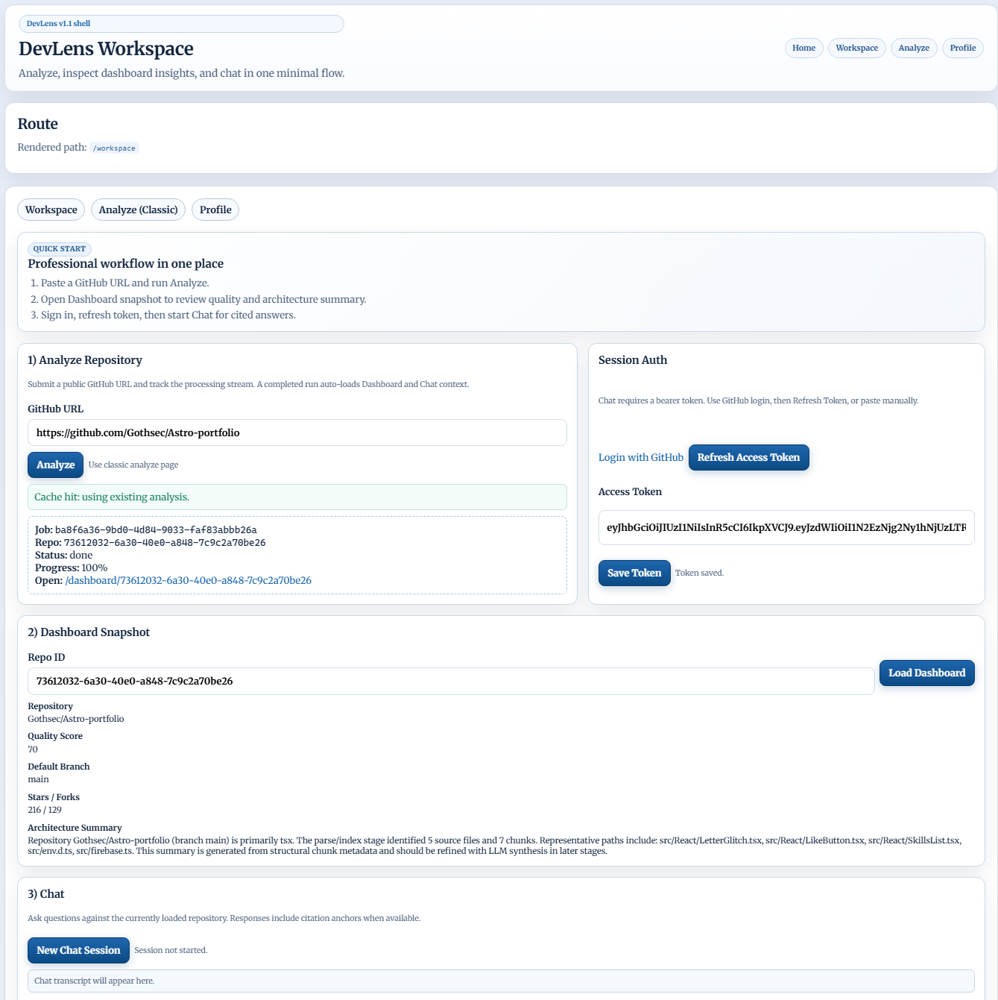
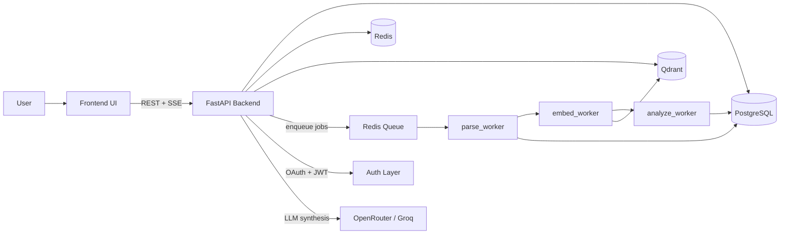

# DevLens

DevLens is a full-stack repository intelligence platform that analyzes public GitHub repositories and gives you:
- architecture and quality insights
- searchable repository context
- citation-grounded chat over indexed code

It is built as a production-oriented pipeline (API + workers + vector store + UI), and can run both locally with Docker and in the cloud (Railway).

## Live Deployment

- Frontend: https://frontend-production-57b0.up.railway.app/workspace
- Backend health: https://backend-production-52c13.up.railway.app/health

## Demo Screenshot



## Why DevLens

When you open a new repository, understanding it quickly is hard. DevLens automates that first-pass intelligence:
1. ingest repo
2. parse and chunk code
3. embed chunks for semantic search
4. generate analysis summary and quality signals
5. answer questions with source citations

## What You Can Do

- Analyze any public GitHub repository URL.
- Track analysis progress in real time.
- Open dashboard snapshots for architecture and quality context.
- Start chat sessions tied to a repository.
- Ask engineering questions and get citation-backed responses.
- Share analysis output through signed share links.

## System Architecture


```mermaid
flowchart LR
  U[User] --> FE[Frontend UI]
  FE -->|REST + SSE| API[FastAPI Backend]

  API --> PG[(PostgreSQL)]
  API --> RD[(Redis)]
  API --> QD[(Qdrant)]

  API -->|enqueue jobs| RQ[Redis Queue]
  RQ --> P[parse_worker]
  P --> E[embed_worker]
  E --> A[analyze_worker]

  P --> PG
  E --> QD
  A --> PG

  API -->|OAuth + JWT| AUTH[Auth Layer]
  API -->|LLM synthesis| LLM[OpenRouter / Groq]
```

## Tech Stack

### Backend
- Python, FastAPI
- SQLAlchemy + Alembic
- PostgreSQL
- Redis (queue + caching + limits)
- Qdrant (vector search)

### Workers
- Python worker services (`parse_worker`, `embed_worker`, `analyze_worker`)
- RQ-style async job processing

### Frontend
- Node.js server-rendered UI (`frontend/server.js`)
- Workspace-centered flow (Analyze -> Dashboard -> Chat)

### AI / Retrieval
- Dense retrieval (Qdrant)
- Lexical retrieval (PostgreSQL FTS)
- Optional reranker (`cross-encoder/ms-marco-MiniLM-L-6-v2`)
- LLM provider routing (OpenRouter primary, Groq fallback)

### Infra
- Docker Compose for local stack
- Railway for cloud deployment
- GitHub OAuth for auth

## Repository Structure

- `backend/` FastAPI API service
- `workers/` async analysis pipeline
- `frontend/` production UI server
- `frontend-next/` next-phase migration scaffold
- `docs/` contracts, planning, QA, runbooks
- `scripts/` automation for setup, tests, deploy, eval
- `assets/` static assets (screenshots)

## End-to-End Runtime Flow

1. User submits GitHub URL from `/workspace` or `/analyze`.
2. Backend creates/updates repository record and enqueues a job.
3. `parse_worker` clones and chunks source code.
4. `embed_worker` generates vectors and upserts into Qdrant.
5. `analyze_worker` computes architecture/quality summaries.
6. UI streams status updates from SSE endpoint.
7. Dashboard API exposes final analysis payload.
8. Chat session retrieves relevant chunks and synthesizes response with citations.

## Prerequisites

- Docker Desktop (or Docker Engine + Compose)
- PowerShell (Windows) or Bash
- Node.js 20+ (for frontend scripts/tests)
- Python 3.11+ (if running some checks outside containers)

## Local Setup (Beginner-Friendly)

### 1. Clone and enter project

```powershell
git clone https://github.com/atikulmunna/devlens-fullstack.git
cd devlens-fullstack
```

### 2. Create local env files

Copy examples to real env files (do not commit secrets):

```powershell
Copy-Item backend/.env.example backend/.env
Copy-Item workers/.env.example workers/.env
Copy-Item frontend/.env.example frontend/.env
```

### 3. Fill required secrets

At minimum, set these in `backend/.env`:
- `GITHUB_CLIENT_ID`
- `GITHUB_CLIENT_SECRET`
- `JWT_SECRET`

Recommended for better chat quality/fallback:
- `OPENROUTER_API_KEY`
- `GROQ_API_KEY`

Set in `workers/.env` as well:
- `OPENROUTER_API_KEY`
- `GROQ_API_KEY`

### 4. Start services

```powershell
./scripts/dev-up.ps1
```

### 5. Run DB migrations

```powershell
./scripts/db-migrate.ps1
```

### 6. Open app

- Workspace: http://localhost:3000/workspace
- Classic analyze page: http://localhost:3000/analyze
- Backend health: http://localhost:8000/health

## Environment Variables Reference

### Backend (`backend/.env`)

Required core:
- `DATABASE_URL`
- `REDIS_URL`
- `QDRANT_URL`
- `QDRANT_COLLECTION`
- `GITHUB_CLIENT_ID`
- `GITHUB_CLIENT_SECRET`
- `GITHUB_OAUTH_REDIRECT_URI`
- `FRONTEND_URL`
- `JWT_SECRET`

Provider / model controls:
- `OPENROUTER_API_KEY`
- `GROQ_API_KEY`
- `LLM_CHAT_MODEL`
- `LLM_PRIMARY_PROVIDER`
- `LLM_FALLBACK_PROVIDER`
- `LLM_FALLBACK_MODEL`

Retrieval controls:
- `RERANKER_ENABLED`
- `RERANKER_MODEL`
- `RERANKER_CANDIDATE_LIMIT`

### Workers (`workers/.env`)

Required core:
- `REDIS_URL`
- `DATABASE_URL`
- `QDRANT_URL`
- `QDRANT_COLLECTION`

LLM synthesis for analysis summary:
- `LLM_SUMMARY_PROVIDER`
- `LLM_SUMMARY_MODEL`
- `OPENROUTER_API_KEY`
- `GROQ_API_KEY`

Pipeline tuning:
- `PARSE_MAX_FILES`
- `PARSE_MAX_CHUNKS`
- `EMBED_BATCH_SIZE`

### Frontend (`frontend/.env`)

- `NEXT_PUBLIC_API_URL` (usually `http://localhost:8000` in local)
- `PORT` (default `3000`)

## Authentication Overview

DevLens uses GitHub OAuth + backend JWT session flow:
1. Start login from `/api/v1/auth/github?next=/workspace`
2. Callback hits backend (`/api/v1/auth/callback`)
3. Backend sets refresh/session cookies
4. Frontend can call `/api/v1/auth/refresh` to get access token
5. Access token is sent as `Authorization: Bearer ...` for chat APIs

CSRF protection:
- cookie: `devlens_csrf_token`
- header: `X-CSRF-Token`

## API Highlights

Base path: `/api/v1`

Repository:
- `POST /repos/analyze`
- `GET /repos/{repo_id}/status` (SSE)
- `GET /repos/{repo_id}/dashboard`
- `GET /repos/{repo_id}/dependency-graph`

Chat:
- `POST /chat/sessions`
- `GET /chat/sessions?repo_id=...`
- `GET /chat/sessions/{session_id}`
- `POST /chat/sessions/{session_id}/message` (SSE stream)

Auth:
- `GET /auth/github`
- `GET /auth/callback`
- `POST /auth/refresh`

Share/Export:
- `POST /export/{repo_id}/share`
- `DELETE /export/share/{share_id}`
- `GET /share/{token}`

## Testing and Validation

### Core tests

```powershell
./scripts/test-backend.ps1
./scripts/test-worker.ps1
npm --prefix frontend test
```

### Smoke / E2E

```powershell
./scripts/smoke-e2e.ps1
```

### Chat quality eval

```powershell
./scripts/eval-chat-quality.ps1 -BaseUrl http://localhost:8000 -AccessToken <TOKEN>
```

Outputs are written under `artifacts/chat-quality/<run_id>/`.

## Deployment (Railway)

Production currently uses Railway services for:
- frontend
- backend
- worker
- postgres
- redis
- qdrant

Important deployment note:
- For frontend deploy from monorepo root, use path-as-root:

```powershell
railway up frontend --path-as-root --service frontend
```

If you deploy from root without path-as-root, Railpack may fail to detect frontend app.

## New User Walkthrough

1. Open `/workspace`.
2. Paste GitHub URL -> click Analyze.
3. Wait until status reaches done.
4. Load Dashboard (auto context or repo ID).
5. Login with GitHub.
6. Refresh and save access token.
7. Create chat session and ask questions.

Recommended starter prompts:
- "Summarize this repository in 6 bullets."
- "What are the core modules and how do they interact?"
- "Where is authentication implemented?"
- "List likely technical debt areas with citations."

## Troubleshooting

### UI looks old after deploy
- Hard refresh browser (`Ctrl+F5`).
- Confirm latest frontend deployment is `SUCCESS`.
- Ensure deploy used `frontend --path-as-root`.

### Analyze starts but no progress
- Check backend + worker logs.
- Verify Redis/Postgres/Qdrant are healthy.
- Ensure repo URL is public and reachable.

### Chat says no token / 401
- Run GitHub login flow.
- Refresh token from auth endpoint.
- Save access token in Workspace before chat calls.

### GitHub OAuth redirect_uri mismatch
- OAuth app callback URL must exactly match backend setting:
  - local: `http://localhost:8000/api/v1/auth/callback`
  - prod: `https://backend-production-52c13.up.railway.app/api/v1/auth/callback`

## Security and Production Notes

- Keep `.env` files out of git (`.gitignore` enforced).
- Rotate compromised secrets immediately.
- Use branch protection + CI checks for production safety.
- Keep production and staging env values isolated.

## Useful Scripts

- `scripts/dev-up.ps1` / `scripts/dev-down.ps1`
- `scripts/db-migrate.ps1`
- `scripts/test-backend.ps1`
- `scripts/test-worker.ps1`
- `scripts/smoke-e2e.ps1`
- `scripts/eval-chat-quality.ps1`
- `scripts/deploy_railway_prod.ps1`
- `scripts/deploy_railway_staging.ps1`

## Documentation Index

- API contract: `docs/api/API_Contract_v1.1.md`
- Implementation checklist: `docs/planning/Implementation_Checklist.md`
- CI/CD runbook: `docs/release/CI_CD_Runbook.md`
- Deployment checklist: `docs/release/Phase5_Deployment_Checklist.md`
- Staging parity runbook: `docs/release/Staging_Managed_Parity_Runbook.md`
- Frontend cutover runbook: `docs/release/Frontend_Cutover_Rollback_Runbook.md`
- QA report: `docs/testing/Release_QA_v1.1.md`

## License

Add your preferred license in this repository (for example MIT) if you plan to distribute or accept contributions publicly.
